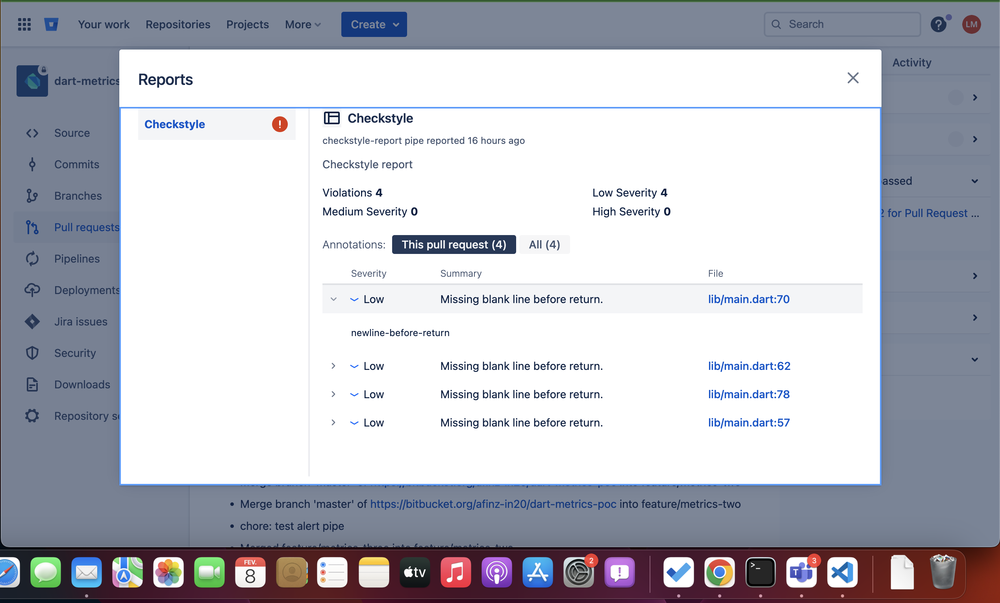
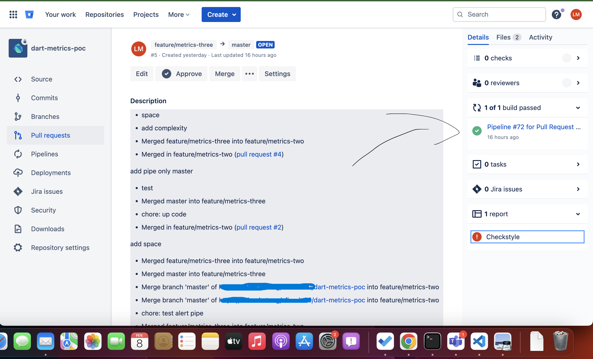

# Dart Metrics Example -  Bitbucket

An example project using the [dart metrics](https://pub.dev/packages/metrics) package.

## How to use

To use the package, you need to add the following code in your `pubspec.yaml` file in the `dev_dependencies` section:

```yaml
dev_dependencies:
  flutter_test:
    sdk: flutter

  dart_code_metrics: ^5.3.0
```

After that, create or configure the `analysis_options.yaml` file with the rules that will be used to analyze your project. For example:

```yaml
 
include: package:flutter_lints/flutter.yaml


linter:
 
  rules:

analyzer:
  plugins:
    - dart_code_metrics

dart_code_metrics:
    metrics:
    number-of-parameters: 4
    cyclomatic-complexity: 20
    maximum-nesting-level: 5
    metrics-exclude:
      - test/**
    rules:
      - newline-before-return
      - no-boolean-literal-compare
      - no-empty-block
      - prefer-trailing-comma
      - prefer-conditional-expressions
      - no-equal-then-else

    anti-patterns:
      - long-method
      - long-parameter-list

```

## Activating Dart Code Metrics

To activate Dart Code Metrics, run the following command in the terminal:

```bash
dart pub global activate dart_code_metrics
```

After this, the dart metrics will be active and ready to be used and will already be analyzing all the code in your project.

----

## Real-Time Analysis Example


# Dart Metrics on CI 
To use the dart metrics on CI, specifically as a pipeline in Bitbucket, you must create the `bitbucket-pipelines.yml` file at the root of your project and add the following code:

*note: replace `TARGET_BRANCH` with the name of the target branch you want the dart metrics to run on.*

```yaml
image: dart

pipelines:
  pull-requests:
    '**':
      - step:
          name: Dart Code Metrics
          script:
          # *note: replace `TARGET_BRANCH` with the name of the target branch you want the dart metrics to run on.*
          - if [ "$BITBUCKET_PR_DESTINATION_BRANCH" == "TARGET_BRANCH" ]; then dart pub global activate dart_code_metrics; fi

          - if [ "$BITBUCKET_PR_DESTINATION_BRANCH" == "TARGET_BRANCH" ]; then dart pub global run dart_code_metrics:metrics analyze --fatal-style --fatal-performance --fatal-warnings --reporter=checkstyle lib > checkstyle-result.xml; fi || exit 0 

          - if [ "$BITBUCKET_PR_DESTINATION_BRANCH" == "TARGET_BRANCH" ]; then dart run dart_code_metrics:metrics analyze lib -r html; fi
          

          artifacts:
                 - metrics/**
          after-script:
            - pipe: atlassian/checkstyle-report:0.3.1
      
       
```


This code will run the dart metrics only when a pull request is made to the target branch and will generate an HTML report and a checkstyle report, which can be used to be integrated with Bitbucket.

## checkstyle-result.xml File
[checkstyle](assets/checkstyle-result.xml)
This will be reported in Bitbucket as in the example below:

[](assets/checkstyle.png)

If there is any warning or error, the checkstyle icon will turn red, as in the example above.

Clicking on the report will open a page with the more detailed report of the analysis done by the dart metrics, as in the example below:

[](assets/bitbucket_analise.png)

Here you can see the errors and warnings in your project, and click on each one to see the code that is generating the error or warning.

## Deeper analysis through the html report
In addition to the checkstyle report, the dart metrics also generates an html report, which can be accessed through the artifacts generated by the pipeline in bitbucket. To access them, simply click on the pipeline build and go to the artifacts tab, then click on the cloud icon to download the html report, as shown in the example below:

[](assets/click_pipe.png)

[](assets/metric_html_download.png)

After that, just extract the folder and open the `index.html` file in your browser, as shown in the example below:

[](assets/zip_files.png)

By clicking on `lib`, you can access the files in your project and see the errors and warnings of each one.

[](assets/metric_html.png)

Example of analyzing a file:

[](assets/metric_file.png)

# For more information about Dart Code Metrics, please visit the link below:
https://dcm.dev/docs/individuals/getting-started