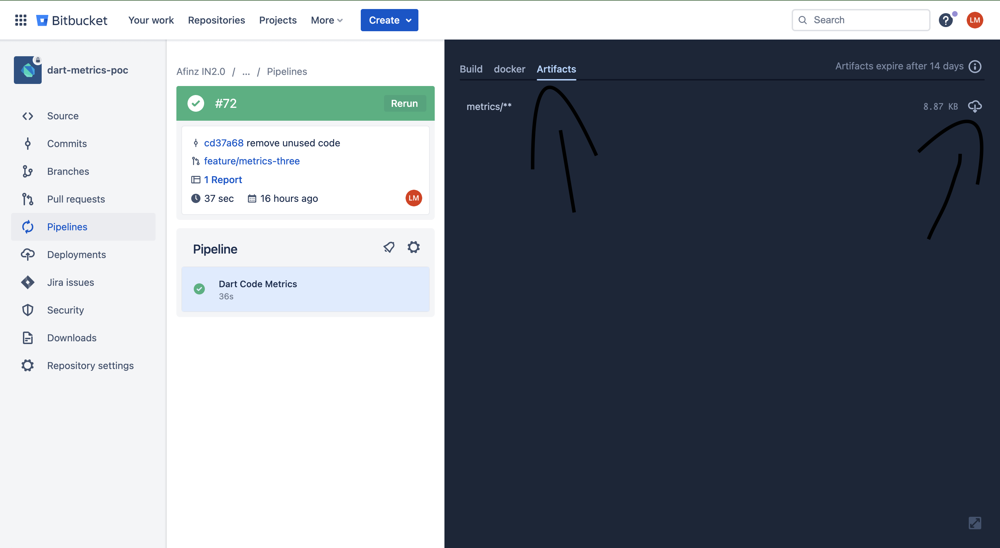
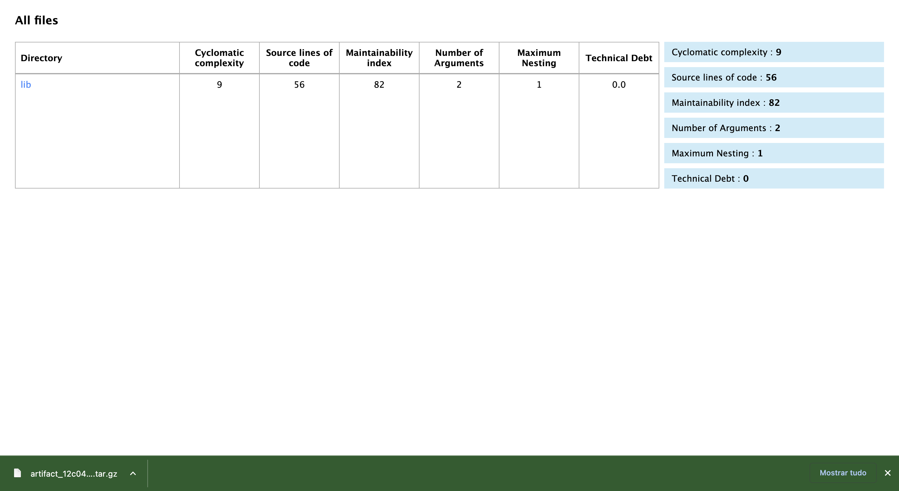

# metrics_example

Um projeto de exemplo usando o pacote [dart metrics](https://pub.dev/packages/metrics).

## Como usar

Para usar o pacote, você precisa adicionar o seguinte código no seu arquivo `pubspec.yaml` na seção `dev_dependencies`:

```yaml
dev_dependencies:
  flutter_test:
    sdk: flutter

  dart_code_metrics: ^5.3.0
```

Após isso, criei ou configure o arquivo `analysis_options.yaml` com as regras que serão usadas para analisar o seu projeto. Por exemplo:

```yaml
 
include: package:flutter_lints/flutter.yaml


linter:
 
  rules:

analyzer:
  plugins:
    - dart_code_metrics

dart_code_metrics:
    metrics:
    number-of-parameters: 4
    cyclomatic-complexity: 20
    maximum-nesting-level: 5
    metrics-exclude:
      - test/**
    rules:
      - newline-before-return
      - no-boolean-literal-compare
      - no-empty-block
      - prefer-trailing-comma
      - prefer-conditional-expressions
      - no-equal-then-else

    anti-patterns:
      - long-method
      - long-parameter-list

```

## Ativando o Dart Code Metrics

Para ativar o Dart Code Metrics, rode o seguinte comando no terminal:

```bash
dart pub global activate dart_code_metrics
```
após fazer isso você o dart metrics já estará ativo e pronto para ser usado e ja estara analisando todo o código do seu projeto.

----

## Exemplo de Analise em tempo real
[](assets/analise.png)


 # Dart metrics no CI 
Para usar o dart metrics no CI, especificamente como pipeline no bitbucket, voce deve criar o arquivo `bitbucket-pipelines.yml` na raiz do seu projeto e adicionar o seguinte código:

```yaml
image: dart

pipelines:
  pull-requests:
    '**':
      - step:
          name: Dart Code Metrics
          script:
          - if [ "$BITBUCKET_PR_DESTINATION_BRANCH" == "BRANCH_ALVO" ]; then dart pub global activate dart_code_metrics; fi

          - if [ "$BITBUCKET_PR_DESTINATION_BRANCH" == "BRANCH_ALVO" ]; then dart pub global run dart_code_metrics:metrics analyze --fatal-style --fatal-performance --fatal-warnings --reporter=checkstyle lib > checkstyle-result.xml; fi || exit 0 

          - if [ "$BITBUCKET_PR_DESTINATION_BRANCH" == "BRANCH_ALVO" ]; then dart run dart_code_metrics:metrics analyze lib -r html; fi
          

          artifacts:
                 - metrics/**
          after-script:
            - pipe: atlassian/checkstyle-report:0.3.1
      
       
```
*note: substitua `BRANCH_ALVO` pelo nome da branch alvo que você deseja que o dart metrics rode.*


Este código irá rodar o dart metrics somente quando for feito um pull request para a branch alvo, e irá gerar um relatório em html e um relatório em checkstyle, que pode ser usado para ser integrado com o bitbucket.

## Arquivo checkstyle-result.xml
[](assets/checkstyle-result.xml) 

Esteserá reportado no bitbucket como no exemplo abaixo:

[](assets/checkstyle.png)

Caso tenha alguma advertencia ou erro, o icone do checkstyle irá ficar vermelho, como no exemplo acima.

Ao clicar no report, será aberto uma página com o relatório mais detalhado da analise feita pelo dart metrics, como no exemplo abaixo: 

[](assets/bitbucket_analise.png)

Aqui você pode ver os erros e advertencias do seu projeto, e clicar em cada um deles para ver o código que está gerando o erro ou a advertencia.


## Analise mais profunda atraves do relatório em html
 além do relatório em checkstyle, o dart metrics também gera um relatório em html, que pode ser atraves dos artefatos gerados pelo pipeline no bitbucket, para acessa-los, basta clicar no build do pipeline e ir na aba artefatos e clicar no icone de nuvem para baixar o relatório em html, como no exemplo abaixo :


[](assets/click_pipe.png)


[](assets/metric_html_download.png)


Apos isso é só descompactar a pasta e abrir o arquivo `index.html` no seu navegador, como no exemplo abaixo:

[](assets/zip_files.png)

Clicando em `lib` voce pode acessar os arquivos do seu projeto e ver os erros e advertencias de cada um deles.

[](assets/metric_html.png)

exemplo de analise de um arquivo:
[](assets/metric_file.png)


# Para mais informações sobre o Dart Code Metrics acesse o link abaixo:
https://dcm.dev/docs/individuals/getting-started

